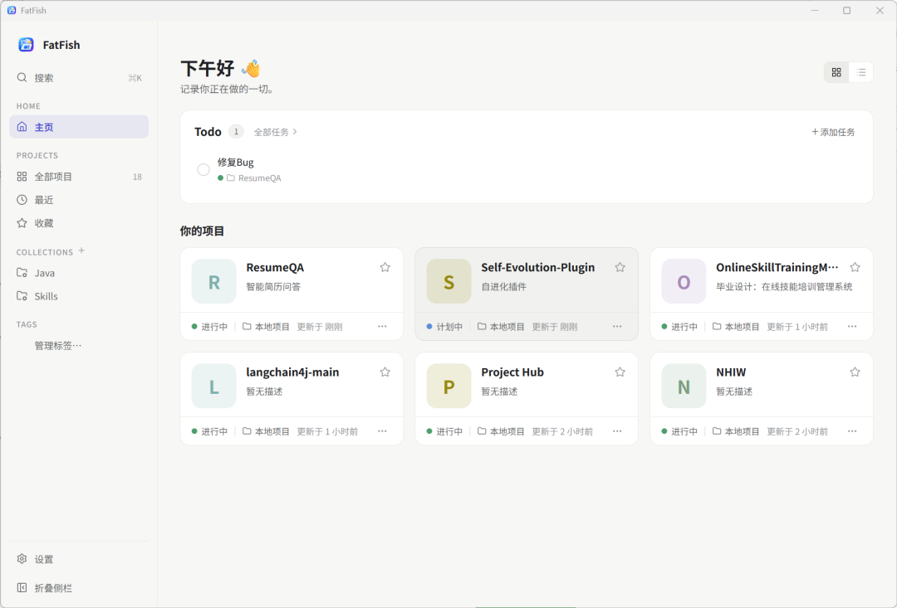

# FatFish

[](https://github.com/ctctoo/FatFish/actions/workflows/pages.yml)
[](https://github.com/ctctoo/FatFish#license)

**Local-First 的桌面项目空间管理器。**
把散落在磁盘各处的项目、论文、旅行计划、设计稿、课程作业——所有你在本机做的事情，收进一个清爽的首页。扫描、索引、组织、记录，随时一键回到工作现场。

> 数据全部存在本机，不依赖任何云端服务。你的项目文件夹永远不会被改动——FatFish 只做记录者。

🌐 **[产品介绍页](https://ctctoo.github.io/FatFish/)**



---

## 为什么做 FatFish

本地磁盘上的项目总是越来越多：

- `~/Dev`、`~/Projects`、`~/Documents` 里有几十个仓库或资料夹
- 每个项目的状态、TODO、关联链接、Git 分支都散落在各自目录里
- 找项目靠翻文件夹，切上下文靠记忆力

FatFish 不管理你的代码，只管理**项目的入口与上下文**。它读取你的目录结构建立索引，让你用 `Ctrl+K` 秒级抵达任何一个项目。

---

## 功能

### 项目库

- **本地扫描导入**：指向父目录，自动识别一级子目录中的项目。通过特征文件判断技术栈：
  - `pom.xml` → Java
  - `build.gradle(.kts)` → Java / Android（检测 `AndroidManifest.xml`）
  - `package.json` + `tsconfig.json` → TypeScript，否则 JavaScript
  - `Cargo.toml` → Rust
  - `go.mod` → Go
  - `requirements.txt` / `pyproject.toml` / `setup.py` → Python
- **项目状态**：`计划中 / 进行中 / 已暂停 / 已完成 / 已归档`，一键切换，状态变更自动记录
- **封面系统**：首字母 + 主题色封面，项目卡片不再千篇一律
- **收藏与最近打开**：常用项目置顶，最近活跃的自动上浮

### 组织方式

- **集合（Collections）**：按用途自由分组，扫描结果可批量导入到指定集合
- **标签（Tags）**：彩色标签系统，支持按标签筛选
- **多维度筛选**：状态 / 集合 / 标签 / 收藏 / 最近，配合排序快速定位

### 记录与追踪

- **跨项目 Todo**：首页待办面板，任务可关联项目、设置截止日期
- **项目链接**：GitHub / 官网 / 文档 / 设计稿 / Demo / 论文 / 云盘 / 其他
- **备注**：自由文本 Markdown 记录项目上下文
- **活动时间线**：自动记录创建、描述更新、链接添加、Todo 创建、状态变更
- **Git 只读信息**：remote、分支、最后 commit、dirty 状态，Git 不可用时自动降级，绝不报错

### 桌面体验

- **命令面板**：`Ctrl+K` 全局搜索项目、标签、路径
- **网格 / 列表双视图**：可折叠侧栏，原生桌面窗口
- **明暗主题**：浅色 / 深色 / 跟随系统
- **中英双语**：设置内一键切换

### Agent / MCP 集成

- **内置 MCP 服务器**：FatFish 可作为 MCP（Model Context Protocol）服务器，让 Claude Desktop、Cursor、Windsurf、Claude Code、Codex CLI、opencode、VS Code 等 AI Agent 读写你的项目数据
- **设置页一键开启**：在「设置 → Agent / MCP」打开开关，自动检测本机已安装的客户端并写入配置（关闭时自动移除），无需手动编辑任何 JSON
- **暴露 5 个工具**：
  - `project_overview` — 项目概览：名称、描述、本地路径、Git 远程地址
  - `update_project` — 修改项目描述 / 追加计划到项目备注
  - `add_todo` — 创建 Todo，可关联项目与截止日期
  - `git_log` — 读取项目 Git 提交记录、分支与最新提交摘要
  - `recent_and_favorite_projects` — 最近打开与收藏的项目

---

## 技术栈

| 层 | 技术 |
|---|---|
| 桌面框架 | Tauri 2（Rust + 系统 WebView） |
| 前端 | Vue 3 + TypeScript + Vite + Pinia + Vue Router |
| 后端 | Rust，Command → Service → Repository → SQLite 分层 |
| 存储 | SQLite（rusqlite bundled，随应用分发） |
| Agent 集成 | MCP 服务器（rmcp，stdio 传输，`--mcp` 模式运行） |
| 国际化 | 自研轻量 i18n（字典 + `useI18n()`，locale 持久化） |

---

## 快速开始

环境要求：Node 18+、Rust stable（MSVC）、WebView2（Windows 10+ 自带）。

```bash
npm install          # 安装依赖
npm run tauri dev    # 开发模式启动
npm run tauri build  # 构建发行版（位于 src-tauri/target/release/bundle/）
```

---

## 数据与隐私

- SQLite 数据库位于系统应用数据目录：`%APPDATA%/com.fatfish.app/fatfish.db`
- 从索引中移除项目**不会**删除磁盘上的项目文件夹
- 不联网、不上报、不同步，卸载即走

---

## 文档与链接

- [🌐 产品介绍页](https://ctctoo.github.io/FatFish/) —— 自动部署自 `promo.html`
- [MvpPlan.md](docs/MvpPlan.md) —— MVP 规划
- [UIPlan.md](docs/UIPlan.md) —— UI 设计方案

---

## License

MIT
